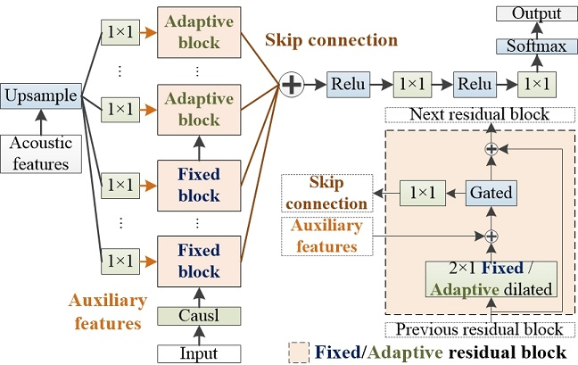
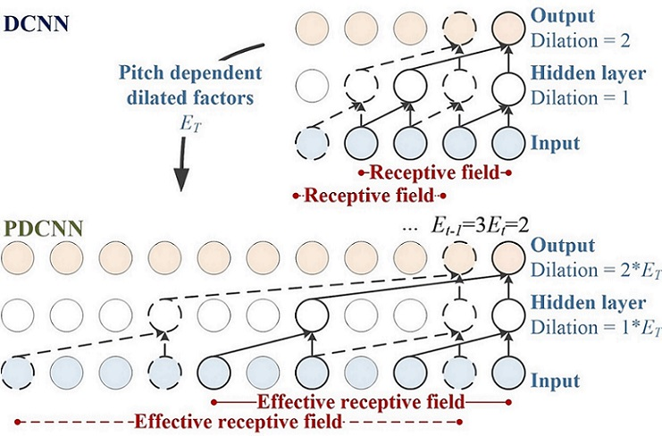
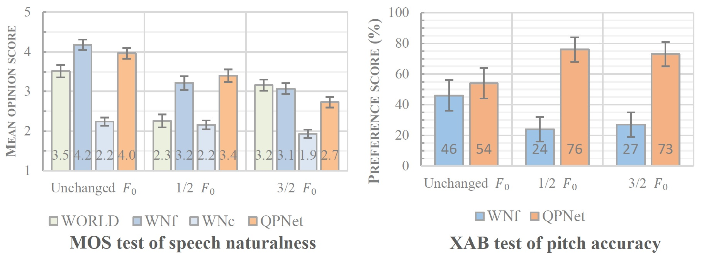
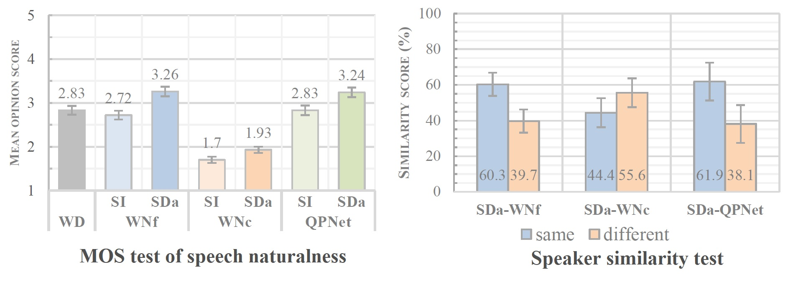

This page is the demo of 
1. "Quasi-Periodic WaveNet vocoder: a pitch dependent dilated convolution model for parametric speech generation" [[paper](https://arxiv.org/abs/1907.00797)] [[code](https://github.com/bigpon/QPNet)]  
2. "Statistical voice conversion with Quasi-Periodic WaveNet vocoder" [[paper](https://arxiv.org/abs/1907.08940)]  
3. "Quasi-Periodic WaveNet: a frequency adaptive generative model for raw waveform" [paper]  

## **Abstract**  

 We propose a WaveNet-like quasi-periodic audio waveform generation model (QPNet) with a novel network architecture named pitch-dependent dilated convolution neural network (PDCNN) to improve the pitch controllability of WaveNet (WN). The effectiveness of the WN as a vocoder to generate high-fidelity speech samples on the basis of the given acoustic features has been proved recently. However, because of the fixed dilated convolution neural network (DCNN) and generic network architecture, the WN vocoder has the difficulty to generate speech with the given fundamental frequency (<i>F</i>0) values which are outside the range observed in training data. To address this limitation, we propose the QPNet vocoder with a PDCNN component and a cascade network structure to respectively model the long- and short-term correlations of speech samples. Specifically, PDCNN is a variant of DCNN which has the time-variant adaptive dilation size related to the given <i>F</i>0 values. QPNet cascades the adaptive (with PDCNN layers) and fixed (with DCNN layers) modules to respectively model the periodicity and local correlations of speech signals. 

Testing corpus: [VCC2018](http://www.vc-challenge.org/)  

## **Architecture of QPNet vocoder**  

  
    
## **Pitch-dependent dilated convolution**  

  
  
## **Pitch transformation**
- Conditioned on **unchanged** *F*0

| Vocoder              | Female (SF3)                                                                  | Male (SM3)                                                                    |
|:---------------------|:-----------------------------------------------------------------------------:|:-----------------------------------------------------------------------------:|
| **Natural**          | <audio src="res/audio/SF3/Natural/30009.wav" controls preload></audio>        | <audio src="res/audio/SM3/Natural/30002.wav" controls preload></audio>        |
| WORLD                | <audio src="res/audio/SF3/1_0_F0/WORLD/30009.wav" controls preload></audio>   | <audio src="res/audio/SM3/1_0_F0/WORLD/30002.wav" controls preload></audio>   |
| WNf *1    | <audio src="res/audio/SF3/1_0_F0/WNf/30009.wav" controls preload></audio>     | <audio src="res/audio/SM3/1_0_F0/WNf/30002.wav" controls preload></audio>     |
| WNc *2    | <audio src="res/audio/SF3/1_0_F0/WNc/30009.wav" controls preload></audio>     | <audio src="res/audio/SM3/1_0_F0/WNc/30002.wav" controls preload></audio>     |
| QPNet *3  | <audio src="res/audio/SF3/1_0_F0/QPNet/30009.wav" controls preload></audio>   | <audio src="res/audio/SM3/1_0_F0/QPNet/30002.wav" controls preload></audio>   |
| rQPNet *4 | <audio src="res/audio/SF3/1_0_F0/rQPNet/30009.wav" controls preload></audio>  | <audio src="res/audio/SM3/1_0_F0/rQPNet/30002.wav" controls preload></audio>  |
| full QPNet           | <audio src="res/audio/SF3/1_0_F0/QPNetf/30009.wav" controls preload></audio>  | <audio src="res/audio/SM3/1_0_F0/QPNetf/30002.wav" controls preload></audio>  |
| full rQPNet          | <audio src="res/audio/SF3/1_0_F0/rQPNetf/30009.wav" controls preload></audio> | <audio src="res/audio/SM3/1_0_F0/rQPNetf/30002.wav" controls preload></audio> |

*1. `WNf: WaveNet vocoder with full-size (30 layers)`    
*2. `WNc: WaveNet vocoder with compact-size (16 layers)`   
*3. `QPNet: QPNet vocoder with fixed-adaptive order(16 layers)`   
*4. `rQPNet: QPNet vocoder with reversed adaptive-fixed order(16 layers)`   
**. `full: full-size (r)QPNet vocoder(34 layers)`   
- Conditioned on **1/2** *F*0

| Vocoder           | Female (SF3)                                                                  | Male (SM3)                                                                    |
|:------------------|:-----------------------------------------------------------------------------:|:-----------------------------------------------------------------------------:|
| WORLD             | <audio src="res/audio/SF3/0_5_F0/WORLD/30009.wav" controls preload></audio>   | <audio src="res/audio/SM3/0_5_F0/WORLD/30002.wav" controls preload></audio>   |
| WNf               | <audio src="res/audio/SF3/0_5_F0/WNf/30009.wav" controls preload></audio>     | <audio src="res/audio/SM3/0_5_F0/WNf/30002.wav" controls preload></audio>     |
| WNc               | <audio src="res/audio/SF3/0_5_F0/WNc/30009.wav" controls preload></audio>     | <audio src="res/audio/SM3/0_5_F0/WNc/30002.wav" controls preload></audio>     |
| QPNet             | <audio src="res/audio/SF3/0_5_F0/QPNet/30009.wav" controls preload></audio>   | <audio src="res/audio/SM3/0_5_F0/QPNet/30002.wav" controls preload></audio>   |
| rQPNet            | <audio src="res/audio/SF3/0_5_F0/rQPNet/30009.wav" controls preload></audio>  | <audio src="res/audio/SM3/0_5_F0/rQPNet/30002.wav" controls preload></audio>  |
| full QPNet        | <audio src="res/audio/SF3/0_5_F0/QPNetf/30009.wav" controls preload></audio>  | <audio src="res/audio/SM3/0_5_F0/QPNetf/30002.wav" controls preload></audio>  |
| full rQPNet       | <audio src="res/audio/SF3/0_5_F0/rQPNetf/30009.wav" controls preload></audio> | <audio src="res/audio/SM3/0_5_F0/rQPNetf/30002.wav" controls preload></audio> |
  
   
- Conditioned on **3/2** *F*0

| Vocoder           | Female (SF3)                                                                  | Male (SM3)                                                                    |
|:------------------|:-----------------------------------------------------------------------------:|:-----------------------------------------------------------------------------:|
| WORLD             | <audio src="res/audio/SF3/1_5_F0/WORLD/30009.wav" controls preload></audio>   | <audio src="res/audio/SM3/1_5_F0/WORLD/30002.wav" controls preload></audio>   |
| WNf               | <audio src="res/audio/SF3/1_5_F0/WNf/30009.wav" controls preload></audio>     | <audio src="res/audio/SM3/1_5_F0/WNf/30002.wav" controls preload></audio>     |
| WNc               | <audio src="res/audio/SF3/1_5_F0/WNc/30009.wav" controls preload></audio>     | <audio src="res/audio/SM3/1_5_F0/WNc/30002.wav" controls preload></audio>     |
| QPNet             | <audio src="res/audio/SF3/1_5_F0/QPNet/30009.wav" controls preload></audio>   | <audio src="res/audio/SM3/1_5_F0/QPNet/30002.wav" controls preload></audio>   |
| rQPNet            | <audio src="res/audio/SF3/1_5_F0/rQPNet/30009.wav" controls preload></audio>  | <audio src="res/audio/SM3/1_5_F0/rQPNet/30002.wav" controls preload></audio>  |
| full QPNet        | <audio src="res/audio/SF3/1_5_F0/QPNetf/30009.wav" controls preload></audio>  | <audio src="res/audio/SM3/1_5_F0/QPNetf/30002.wav" controls preload></audio>  |
| full rQPNet       | <audio src="res/audio/SF3/1_5_F0/rQPNetf/30009.wav" controls preload></audio> | <audio src="res/audio/SM3/1_5_F0/rQPNetf/30002.wav" controls preload></audio> |
  
   
- Subjective results  

  

## **Speaker voice conversion**
- **Intra** gender conversion

| Vocoder           | Female (SF3->TF1)                                                             | Male (SM3->TM1)                                                               |
|:------------------|:-----------------------------------------------------------------------------:|:-----------------------------------------------------------------------------:|
| **Source**        | <audio src="res/audio/SF3/Natural/30010.wav" controls preload></audio>        | <audio src="res/audio/SM3/Natural/30010.wav" controls preload></audio>        |
| **Target**        | <audio src="res/audio/TF1/Natural/30010.wav" controls preload></audio>        | <audio src="res/audio/TM1/Natural/30010.wav" controls preload></audio>        |
| WORLD             | <audio src="res/audio/SF3/TF1/WORLD/30010.wav" controls preload></audio>      | <audio src="res/audio/SM3/TM1/WORLD/30010.wav" controls preload></audio>      |
| SI-WNf            | <audio src="res/audio/SF3/TF1/SI-WNf/30010.wav" controls preload></audio>     | <audio src="res/audio/SM3/TM1/SI-WNf/30010.wav" controls preload></audio>     |
| SI-WNc            | <audio src="res/audio/SF3/TF1/SI-WNc/30010.wav" controls preload></audio>     | <audio src="res/audio/SM3/TM1/SI-WNc/30010.wav" controls preload></audio>     |
| SI-QPNet          | <audio src="res/audio/SF3/TF1/SI-QPNet/30010.wav" controls preload></audio>   | <audio src="res/audio/SM3/TM1/SI-QPNet/30010.wav" controls preload></audio>   |
| SDo-WNf           | <audio src="res/audio/SF3/TF1/SDo-WNf/30010.wav" controls preload></audio>    | <audio src="res/audio/SM3/TM1/SDo-WNf/30010.wav" controls preload></audio>    |
| SDo-WNc           | <audio src="res/audio/SF3/TF1/SDo-WNc/30010.wav" controls preload></audio>    | <audio src="res/audio/SM3/TM1/SDo-WNc/30010.wav" controls preload></audio>    |
| SDo-QPNet         | <audio src="res/audio/SF3/TF1/SDo-QPNet/30010.wav" controls preload></audio>  | <audio src="res/audio/SM3/TM1/SDo-QPNet/30010.wav" controls preload></audio>  |
| SDa-WNf           | <audio src="res/audio/SF3/TF1/SDa-WNf/30010.wav" controls preload></audio>    | <audio src="res/audio/SM3/TM1/SDa-WNf/30010.wav" controls preload></audio>    |
| SDa-WNc           | <audio src="res/audio/SF3/TF1/SDa-WNc/30010.wav" controls preload></audio>    | <audio src="res/audio/SM3/TM1/SDa-WNc/30010.wav" controls preload></audio>    |
| SDa-QPNet         | <audio src="res/audio/SF3/TF1/SDa-QPNet/30010.wav" controls preload></audio>  | <audio src="res/audio/SM3/TM1/SDa-QPNet/30010.wav" controls preload></audio>  |

**. `SI: speaker independent vocoder`    
**. `SDo: speaker dependent vocoder (only update the output layers of WN)`   
**. `SDa: speaker dependent vocoder (update the whole WN network)`   
   
- **Inter** gender conversion

| Vocoder           | Female to male (SF3->TM1)                                                     | Male to female (SM3->TF1)                                                     |
|:------------------|:-----------------------------------------------------------------------------:|:-----------------------------------------------------------------------------:|
| **Source**        | <audio src="res/audio/SF3/Natural/30005.wav" controls preload></audio>        | <audio src="res/audio/SM3/Natural/30032.wav" controls preload></audio>        |
| **Target**        | <audio src="res/audio/TM1/Natural/30005.wav" controls preload></audio>        | <audio src="res/audio/TF1/Natural/30032.wav" controls preload></audio>        |
| WORLD             | <audio src="res/audio/SF3/TM1/WORLD/30005.wav" controls preload></audio>      | <audio src="res/audio/SM3/TF1/WORLD/30032.wav" controls preload></audio>      |
| SI-WNf            | <audio src="res/audio/SF3/TM1/SI-WNf/30005.wav" controls preload></audio>     | <audio src="res/audio/SM3/TF1/SI-WNf/30032.wav" controls preload></audio>     |
| SI-WNc            | <audio src="res/audio/SF3/TM1/SI-WNc/30005.wav" controls preload></audio>     | <audio src="res/audio/SM3/TF1/SI-WNc/30032.wav" controls preload></audio>     |
| SI-QPNet          | <audio src="res/audio/SF3/TM1/SI-QPNet/30005.wav" controls preload></audio>   | <audio src="res/audio/SM3/TF1/SI-QPNet/30032.wav" controls preload></audio>   |
| SDo-WNf           | <audio src="res/audio/SF3/TM1/SDo-WNf/30005.wav" controls preload></audio>    | <audio src="res/audio/SM3/TF1/SDo-WNf/30032.wav" controls preload></audio>    |
| SDo-WNc           | <audio src="res/audio/SF3/TM1/SDo-WNc/30005.wav" controls preload></audio>    | <audio src="res/audio/SM3/TF1/SDo-WNc/30032.wav" controls preload></audio>    |
| SDo-QPNet         | <audio src="res/audio/SF3/TM1/SDo-QPNet/30005.wav" controls preload></audio>  | <audio src="res/audio/SM3/TF1/SDo-QPNet/30032.wav" controls preload></audio>  |
| SDa-WNf           | <audio src="res/audio/SF3/TM1/SDa-WNf/30005.wav" controls preload></audio>    | <audio src="res/audio/SM3/TF1/SDa-WNf/30032.wav" controls preload></audio>    |
| SDa-WNc           | <audio src="res/audio/SF3/TM1/SDa-WNc/30005.wav" controls preload></audio>    | <audio src="res/audio/SM3/TF1/SDa-WNc/30032.wav" controls preload></audio>    |
| SDa-QPNet         | <audio src="res/audio/SF3/TM1/SDa-QPNet/30005.wav" controls preload></audio>  | <audio src="res/audio/SM3/TF1/SDa-QPNet/30032.wav" controls preload></audio>  |
   
   
- Subjective results  

  
[Home](https://bigpon.github.io/)

   
   