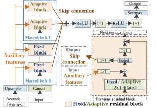

This page is the demo of 
1. "Quasi-Periodic WaveNet: an autoregressive raw waveform generative model with pitch-dependent dilated convolution neural network " [[paper](https://arxiv.org/abs/2007.05663)] [[code](https://github.com/bigpon/QPNet)] [[YouTube](https://youtu.be/nRahlEgywjg)] [[Medium](https://medium.com/@bigpon517/2020-speech-generation-1-quasi-periodic-waveform-generative-model-with-pitch-dependent-dilated-792261d96aba)]  
2. "Quasi-Periodic WaveNet vocoder: a pitch dependent dilated convolution model for parametric speech generation" [[paper](https://arxiv.org/abs/1907.00797)] 
3. "Statistical voice conversion with Quasi-Periodic WaveNet vocoder" [[paper](https://arxiv.org/abs/1907.08940)]  
  

## **Abstract**  

 We propose a WaveNet-like quasi-periodic audio waveform generation model (QPNet) with a novel network architecture named pitch-dependent dilated convolution neural network (PDCNN) to improve pitch controllability of WaveNet (WN). The effectiveness of WN as a vocoder to generate high-fidelity speech samples on the basis of the given acoustic features has been proved. However, because of the fixed dilated convolution neural network (DCNN) and generic network architecture, the WN vocoder has a difficulty to generate speech with the given fundamental frequency (<i>F</i>0) values which are outside the observed <i>F</i>0 range of training data. To address this limitation, we propose the QPNet vocoder with the PDCNN component and a cascade network structure to respectively model the long- and short-term correlations of speech samples. Specifically, PDCNN is a variant of DCNN which has the time-variant adaptive dilation size related to the given <i>F</i>0 values. QPNet cascades the adaptive (with PDCNNs) and fixed (with DCNNs) macroblocks to respectively model the periodicity and local correlations of speech signals. 

Testing corpus: [VCC2018](http://www.vc-challenge.org/)  

## **Architecture of QPNet vocoder**  

  
    
## **Pitch-dependent dilated convolution**  

  
  
## **Pitch transformation**

 To show the pitch controllability of the proposed QPNet vocoder, the pitch-transformed samples generated by different vocoders are provided. The input <i>F</i>0 feature of each vocoder was scaled by <b>1</b>, <b>1/2</b>, and <b>2</b> while keeping the other acoustic features the same as that of natural speech. 

- Conditioned on **unchanged** *F*0

| Vocoder              | Female (SF3)                                                                  | Male (SM3)                                                                    |
|:---------------------|:-----------------------------------------------------------------------------:|:-----------------------------------------------------------------------------:|
| **Natural**          | <audio src="res/audio/SF3/Natural/30009.wav" controls preload></audio>        | <audio src="res/audio/SM3/Natural/30002.wav" controls preload></audio>        |
| WORLD                | <audio src="res/audio/SF3/1_0_F0/WORLD/30009.wav" controls preload></audio>   | <audio src="res/audio/SM3/1_0_F0/WORLD/30002.wav" controls preload></audio>   |
| WNf *1    | <audio src="res/audio/SF3/1_0_F0/WNf/30009.wav" controls preload></audio>     | <audio src="res/audio/SM3/1_0_F0/WNf/30002.wav" controls preload></audio>     |
| WNc *2    | <audio src="res/audio/SF3/1_0_F0/WNc/30009.wav" controls preload></audio>     | <audio src="res/audio/SM3/1_0_F0/WNc/30002.wav" controls preload></audio>     |
| QPNet *3  | <audio src="res/audio/SF3/1_0_F0/QPNet/30009.wav" controls preload></audio>   | <audio src="res/audio/SM3/1_0_F0/QPNet/30002.wav" controls preload></audio>   |
| rQPNet *4 | <audio src="res/audio/SF3/1_0_F0/rQPNet/30009.wav" controls preload></audio>  | <audio src="res/audio/SM3/1_0_F0/rQPNet/30002.wav" controls preload></audio>  |
| full QPNet           | <audio src="res/audio/SF3/1_0_F0/QPNetf/30009.wav" controls preload></audio>  | <audio src="res/audio/SM3/1_0_F0/QPNetf/30002.wav" controls preload></audio>  |
| full rQPNet          | <audio src="res/audio/SF3/1_0_F0/rQPNetf/30009.wav" controls preload></audio> | <audio src="res/audio/SM3/1_0_F0/rQPNetf/30002.wav" controls preload></audio> |

*1. `WNf: WaveNet vocoder with full-size (30 layers)`    
*2. `WNc: WaveNet vocoder with compact-size (16 layers)`   
*3. `QPNet: QPNet vocoder with fixed-adaptive order(16 layers)`   
*4. `rQPNet: QPNet vocoder with reversed adaptive-fixed order(16 layers)`   
**. `full: full-size (r)QPNet vocoder(34 layers)`   
- Conditioned on **1/2** *F*0

| Vocoder           | Female (SF3)                                                                  | Male (SM3)                                                                    |
|:------------------|:-----------------------------------------------------------------------------:|:-----------------------------------------------------------------------------:|
| WORLD             | <audio src="res/audio/SF3/0_5_F0/WORLD/30009.wav" controls preload></audio>   | <audio src="res/audio/SM3/0_5_F0/WORLD/30002.wav" controls preload></audio>   |
| WNf               | <audio src="res/audio/SF3/0_5_F0/WNf/30009.wav" controls preload></audio>     | <audio src="res/audio/SM3/0_5_F0/WNf/30002.wav" controls preload></audio>     |
| WNc               | <audio src="res/audio/SF3/0_5_F0/WNc/30009.wav" controls preload></audio>     | <audio src="res/audio/SM3/0_5_F0/WNc/30002.wav" controls preload></audio>     |
| QPNet             | <audio src="res/audio/SF3/0_5_F0/QPNet/30009.wav" controls preload></audio>   | <audio src="res/audio/SM3/0_5_F0/QPNet/30002.wav" controls preload></audio>   |
| rQPNet            | <audio src="res/audio/SF3/0_5_F0/rQPNet/30009.wav" controls preload></audio>  | <audio src="res/audio/SM3/0_5_F0/rQPNet/30002.wav" controls preload></audio>  |
| full QPNet        | <audio src="res/audio/SF3/0_5_F0/QPNetf/30009.wav" controls preload></audio>  | <audio src="res/audio/SM3/0_5_F0/QPNetf/30002.wav" controls preload></audio>  |
| full rQPNet       | <audio src="res/audio/SF3/0_5_F0/rQPNetf/30009.wav" controls preload></audio> | <audio src="res/audio/SM3/0_5_F0/rQPNetf/30002.wav" controls preload></audio> |
  
   
- Conditioned on **3/2** *F*0

| Vocoder           | Female (SF3)                                                                  | Male (SM3)                                                                    |
|:------------------|:-----------------------------------------------------------------------------:|:-----------------------------------------------------------------------------:|
| WORLD             | <audio src="res/audio/SF3/1_5_F0/WORLD/30009.wav" controls preload></audio>   | <audio src="res/audio/SM3/1_5_F0/WORLD/30002.wav" controls preload></audio>   |
| WNf               | <audio src="res/audio/SF3/1_5_F0/WNf/30009.wav" controls preload></audio>     | <audio src="res/audio/SM3/1_5_F0/WNf/30002.wav" controls preload></audio>     |
| WNc               | <audio src="res/audio/SF3/1_5_F0/WNc/30009.wav" controls preload></audio>     | <audio src="res/audio/SM3/1_5_F0/WNc/30002.wav" controls preload></audio>     |
| QPNet             | <audio src="res/audio/SF3/1_5_F0/QPNet/30009.wav" controls preload></audio>   | <audio src="res/audio/SM3/1_5_F0/QPNet/30002.wav" controls preload></audio>   |
| rQPNet            | <audio src="res/audio/SF3/1_5_F0/rQPNet/30009.wav" controls preload></audio>  | <audio src="res/audio/SM3/1_5_F0/rQPNet/30002.wav" controls preload></audio>  |
| full QPNet        | <audio src="res/audio/SF3/1_5_F0/QPNetf/30009.wav" controls preload></audio>  | <audio src="res/audio/SM3/1_5_F0/QPNetf/30002.wav" controls preload></audio>  |
| full rQPNet       | <audio src="res/audio/SF3/1_5_F0/rQPNetf/30009.wav" controls preload></audio> | <audio src="res/audio/SM3/1_5_F0/rQPNetf/30002.wav" controls preload></audio> |
  
   
- Subjective results  

    

## **Speaker voice conversion (VC)**

 To effectiveness of the proposed QPNet vocoder was also evaluated with our <a href="https://easychair.org/publications/preprint/mzNP">NU non-parallel VC system</a> submitted to VCC2018.

- **Intra** gender conversion

| Vocoder           | Female (SF3->TF1)                                                             | Male (SM3->TM1)                                                               |
|:------------------|:-----------------------------------------------------------------------------:|:-----------------------------------------------------------------------------:|
| **Source**        | <audio src="res/audio/SF3/Natural/30010.wav" controls preload></audio>        | <audio src="res/audio/SM3/Natural/30010.wav" controls preload></audio>        |
| **Target**        | <audio src="res/audio/TF1/Natural/30010.wav" controls preload></audio>        | <audio src="res/audio/TM1/Natural/30010.wav" controls preload></audio>        |
| WORLD             | <audio src="res/audio/SF3/TF1/WORLD/30010.wav" controls preload></audio>      | <audio src="res/audio/SM3/TM1/WORLD/30010.wav" controls preload></audio>      |
| SI-WNf            | <audio src="res/audio/SF3/TF1/SI-WNf/30010.wav" controls preload></audio>     | <audio src="res/audio/SM3/TM1/SI-WNf/30010.wav" controls preload></audio>     |
| SI-WNc            | <audio src="res/audio/SF3/TF1/SI-WNc/30010.wav" controls preload></audio>     | <audio src="res/audio/SM3/TM1/SI-WNc/30010.wav" controls preload></audio>     |
| SI-QPNet          | <audio src="res/audio/SF3/TF1/SI-QPNet/30010.wav" controls preload></audio>   | <audio src="res/audio/SM3/TM1/SI-QPNet/30010.wav" controls preload></audio>   |
| SDo-WNf           | <audio src="res/audio/SF3/TF1/SDo-WNf/30010.wav" controls preload></audio>    | <audio src="res/audio/SM3/TM1/SDo-WNf/30010.wav" controls preload></audio>    |
| SDo-WNc           | <audio src="res/audio/SF3/TF1/SDo-WNc/30010.wav" controls preload></audio>    | <audio src="res/audio/SM3/TM1/SDo-WNc/30010.wav" controls preload></audio>    |
| SDo-QPNet         | <audio src="res/audio/SF3/TF1/SDo-QPNet/30010.wav" controls preload></audio>  | <audio src="res/audio/SM3/TM1/SDo-QPNet/30010.wav" controls preload></audio>  |
| SDa-WNf           | <audio src="res/audio/SF3/TF1/SDa-WNf/30010.wav" controls preload></audio>    | <audio src="res/audio/SM3/TM1/SDa-WNf/30010.wav" controls preload></audio>    |
| SDa-WNc           | <audio src="res/audio/SF3/TF1/SDa-WNc/30010.wav" controls preload></audio>    | <audio src="res/audio/SM3/TM1/SDa-WNc/30010.wav" controls preload></audio>    |
| SDa-QPNet         | <audio src="res/audio/SF3/TF1/SDa-QPNet/30010.wav" controls preload></audio>  | <audio src="res/audio/SM3/TM1/SDa-QPNet/30010.wav" controls preload></audio>  |

**. `SI: speaker independent vocoder`    
**. `SDo: speaker dependent vocoder (only update the output layers of WN)`   
**. `SDa: speaker dependent vocoder (update the whole WN network)`   
   
- **Inter** gender conversion

| Vocoder           | Female to male (SF3->TM1)                                                     | Male to female (SM3->TF1)                                                     |
|:------------------|:-----------------------------------------------------------------------------:|:-----------------------------------------------------------------------------:|
| **Source**        | <audio src="res/audio/SF3/Natural/30005.wav" controls preload></audio>        | <audio src="res/audio/SM3/Natural/30032.wav" controls preload></audio>        |
| **Target**        | <audio src="res/audio/TM1/Natural/30005.wav" controls preload></audio>        | <audio src="res/audio/TF1/Natural/30032.wav" controls preload></audio>        |
| WORLD             | <audio src="res/audio/SF3/TM1/WORLD/30005.wav" controls preload></audio>      | <audio src="res/audio/SM3/TF1/WORLD/30032.wav" controls preload></audio>      |
| SI-WNf            | <audio src="res/audio/SF3/TM1/SI-WNf/30005.wav" controls preload></audio>     | <audio src="res/audio/SM3/TF1/SI-WNf/30032.wav" controls preload></audio>     |
| SI-WNc            | <audio src="res/audio/SF3/TM1/SI-WNc/30005.wav" controls preload></audio>     | <audio src="res/audio/SM3/TF1/SI-WNc/30032.wav" controls preload></audio>     |
| SI-QPNet          | <audio src="res/audio/SF3/TM1/SI-QPNet/30005.wav" controls preload></audio>   | <audio src="res/audio/SM3/TF1/SI-QPNet/30032.wav" controls preload></audio>   |
| SDo-WNf           | <audio src="res/audio/SF3/TM1/SDo-WNf/30005.wav" controls preload></audio>    | <audio src="res/audio/SM3/TF1/SDo-WNf/30032.wav" controls preload></audio>    |
| SDo-WNc           | <audio src="res/audio/SF3/TM1/SDo-WNc/30005.wav" controls preload></audio>    | <audio src="res/audio/SM3/TF1/SDo-WNc/30032.wav" controls preload></audio>    |
| SDo-QPNet         | <audio src="res/audio/SF3/TM1/SDo-QPNet/30005.wav" controls preload></audio>  | <audio src="res/audio/SM3/TF1/SDo-QPNet/30032.wav" controls preload></audio>  |
| SDa-WNf           | <audio src="res/audio/SF3/TM1/SDa-WNf/30005.wav" controls preload></audio>    | <audio src="res/audio/SM3/TF1/SDa-WNf/30032.wav" controls preload></audio>    |
| SDa-WNc           | <audio src="res/audio/SF3/TM1/SDa-WNc/30005.wav" controls preload></audio>    | <audio src="res/audio/SM3/TF1/SDa-WNc/30032.wav" controls preload></audio>    |
| SDa-QPNet         | <audio src="res/audio/SF3/TM1/SDa-QPNet/30005.wav" controls preload></audio>  | <audio src="res/audio/SM3/TF1/SDa-QPNet/30032.wav" controls preload></audio>  |
   
   
- Subjective results  

    

## **Single tone sinusoid generation**

 To evaluate the effectiveness of the proposed PDCNN, a evaluation of simple periodic sinusoid generation was conducted. The training data of QPNet were 80-400 Hz sinusoids and the corresponding <i>F</i>0 values. In the test phase, QPNet was conditioned on an <i>F</i>0 value and a small piece of the related sine wave for the initial <i>receptive field</i> to generate sinusoids. The test data were divided into 10-40 Hz (<b>under 1/2<i>L</i></b>), 50-80 Hz (<b>above 1/2<i>L</i></b>), 100-400 Hz (<b>inside</b>), 450–600 Hz (<b>under 3/2<i>U</i></b>), and 650–800 Hz (<b>above 3/2<i>U</i></b>) subsets. <b><i>L</i></b> is the lower bound and <b><i>U</i></b> is the upper bound of the training <i>F</i>0 range. Moreover, because of the simple periodic signal generation scenario, the QPNet model with the pure PDCNN structure (pQPNet) was adopted.

- **Dense factor** comparison  
First, the pQPNet models with different dense factor were evaluated.

<table border="0">
  <tr>
  <td align="center"> pQPNet <b>(Dense: 8)</b> </td>
  <td align="center"> pQPNet <b>(Dense: 1)</b> </td>
  <td align="center"> pQPNet <b>(Dense: 64)</b> </td>
  </tr>
  <tr> <td colspan="3" align="center"> 20 Hz (Under 1/2<i>L</i>) </td> </tr>
  <tr>
  <td>  </td>
  <td>  </td>
  <td>  </td>
  </tr>
  <tr>
  <td>  </td>
  <td>  </td>
  <td>  </td>
  </tr>
  <tr> <td colspan="3" align="center"> 60 Hz (Above 1/2<i>L</i>) </td> </tr>
  <tr>
  <td>  </td>
  <td>  </td>
  <td>  </td>
  </tr>
  <tr>
  <td>  </td>
  <td>  </td>
  <td>  </td>
  </tr>
  <tr> <td colspan="3" align="center"> 300 Hz (Inside) </td> </tr>
  <tr>
  <td>  </td>
  <td>  </td>
  <td>  </td>
  </tr>
  <tr>
  <td>  </td>
  <td>  </td>
  <td>  </td>
  </tr>
  <tr> <td colspan="3" align="center"> 500 Hz (Under 3/2<i>U</i>) </td> </tr>
  <tr>
  <td>  </td>
  <td>  </td>
  <td>  </td>
  </tr>
  <tr>
  <td>  </td>
  <td>  </td>
  <td>  </td>
  </tr>
  <tr> <td colspan="3" align="center"> 700 Hz (Above 3/2<i>U</i>) </td> </tr>
  <tr>
  <td>  </td>
  <td>  </td>
  <td>  </td>
  </tr>
  <tr>
  <td>  </td>
  <td>  </td>
  <td>  </td>
  </tr>
</table>

   

- **Model** comparison
Secondly, the pQPNet model with a dense factor 8 were compared to the WNc and WNf models.

<table border="0">
  <tr>
  <td align="center"> <b>pQPNet</b> (Dense: 8) </td>
  <td align="center"> <b>WNc</b> </td>
  <td align="center"> <b>WNf</b> </td>
  </tr>
  <tr> <td colspan="3" align="center"> 20 Hz (Under 1/2<i>L</i>) </td> </tr>
  <tr>
  <td>  </td>
  <td>  </td>
  <td>  </td>
  </tr>
  <tr>
  <td>  </td>
  <td>  </td>
  <td>  </td>
  </tr>
  <tr> <td colspan="3" align="center"> 60 Hz (Above 1/2<i>L</i>) </td> </tr>
  <tr>
  <td>  </td>
  <td>  </td>
  <td>  </td>
  </tr>
  <tr>
  <td>  </td>
  <td>  </td>
  <td>  </td>
  </tr>
  <tr> <td colspan="3" align="center"> 300 Hz (Inside) </td> </tr>
  <tr>
  <td>  </td>
  <td>  </td>
  <td>  </td>
  </tr>
  <tr>
  <td>  </td>
  <td>  </td>
  <td>  </td>
  </tr>
  <tr> <td colspan="3" align="center"> 500 Hz (Under 3/2<i>U</i>) </td> </tr>
  <tr>
  <td>  </td>
  <td>  </td>
  <td>  </td>
  </tr>
  <tr>
  <td>  </td>
  <td>  </td>
  <td>  </td>
  </tr>
  <tr> <td colspan="3" align="center"> 700 Hz (Above 3/2<i>U</i>) </td> </tr>
  <tr>
  <td>  </td>
  <td>  </td>
  <td>  </td>
  </tr>
  <tr>
  <td>  </td>
  <td>  </td>
  <td>  </td>
  </tr>
</table>

  
[Home](https://bigpon.github.io/)

   
   